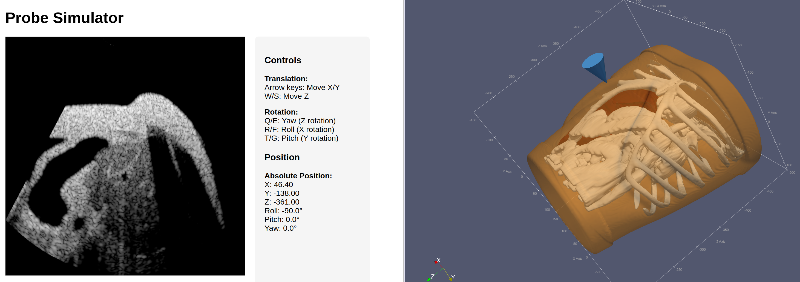
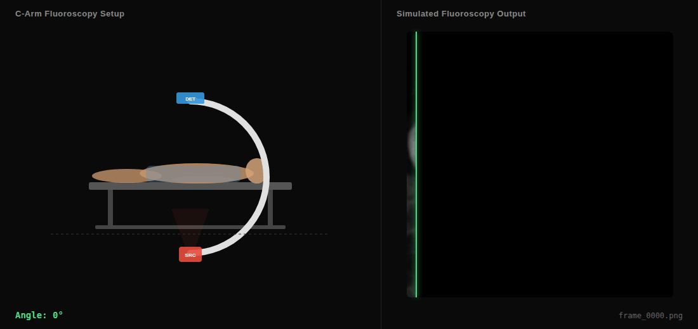

# Isaac for Healthcare - Sensor Simulation

This repository contains *high-performance GPU-accelerated sensor simulation tools* for healthcare applications, powered by NVIDIA technologies. These simulators enable researchers, developers, and healthcare professionals to generate realistic sensor data for training AI models, testing medical procedures, and developing new imaging technologies. By leveraging GPU acceleration and advanced raytracing techniques, our tools provide real-time simulation capabilities that significantly reduce the time and cost associated with data collection while enabling scenarios that would be difficult or impossible to capture in real-world settings.

## Available Sensor Simulators

### Ultrasound Raytracing Simulator



A high-performance GPU-accelerated ultrasound simulator using NVIDIA OptiX raytracing with Python bindings. This simulator enables real-time ultrasound simulation for training, research, and development purposes.

Whether you are developing AI-driven imaging solutions, validating new device concepts, or conducting research in medical imaging, this simulator gives you the power to create high-fidelity ultrasound data on-demand.

Key features:

- GPU acceleration with CUDA and NVIDIA OptiX
- Python interface for ease of use
- Real-time simulation capabilities

[Learn more about the Ultrasound Raytracing Simulator](./ultrasound-raytracing/README.md)

### Fluoroscopy Simulator



GPU-accelerated fluoroscopy (X-ray) simulation from CT volumes using differentiable ray marching.

Key features:

- GPU acceleration with NVIDIA Slang or Warp
- Differentiable rendering for gradient-based optimization
- Two-step workflow: Preprocess CT (HU → μ) then render at any C-arm pose
- Realism post-processing: Poisson noise, Gaussian noise, blur
- High performance: ~5ms/frame at 512×512 on modern GPUs

[Learn more about the Fluoroscopy Simulator](./fluoro-simulator/README.md)

## Getting Started

1. Clone this repository:

   ```bash
   git clone https://github.com/isaac-for-healthcare/i4h-sensor-simulation.git
   cd i4h-sensor-simulation
   ```

2. Follow the setup instructions for the specific simulator you want to use:
   - [Ultrasound Raytracing Simulator](./ultrasound-raytracing/README.md)
   - [Fluoroscopy Simulator](./fluoro-simulator/README.md)

## Support

For questions and support, please open an issue in the GitHub repository.
