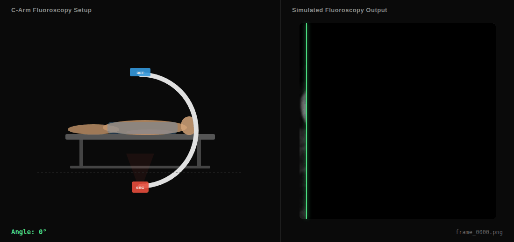

# Isaac for Healthcare - Medical Sensor Simulation

This repository contains *high-performance GPU-accelerated sensor simulation tools* for healthcare applications, powered by NVIDIA technologies. These simulators enable researchers, developers, and healthcare professionals to generate realistic sensor data for training AI models, testing medical procedures, and developing new imaging technologies. By leveraging GPU acceleration and advanced raytracing techniques, our tools provide real-time simulation capabilities that significantly reduce the time and cost associated with data collection while enabling scenarios that would be difficult or impossible to capture in real-world settings.

## Available Sensor Simulators

### Ultrasound Raytracing Simulator


**What it is:** A straight-ray (geometric ray tracing, not wave-solver) B-mode ultrasound simulator with NVIDIA OptiX GPU acceleration and Python bindings, based on [Bürger et al., *Real-Time GPU-Based Ultrasound Simulation Using Deformable Mesh Models*, IEEE Transactions on Medical Imaging 32(3), 2013](https://pubmed.ncbi.nlm.nih.gov/23268382/). It renders plausible B-mode (brightness mode) images from labeled surface meshes in real time, for curvilinear, linear, and phased-array probe geometries.

**Use it for:** applications where B-mode *appearance* and frame rate matter — probe-in-the-loop robotic scanning, sim-to-real robotics perception, and large-scale data generation for RL/ML training.

**Do not use it for:** quantitative acoustics. The straight-ray model does not simulate diffraction, interference, or phase, so it is not a substitute for wave solvers (e.g., k-Wave, Field II) in beamforming, signal-processing, or transducer-design research, and experts in ultrasound signal processing will notice the reduced realism. See [capabilities and limitations](./ultrasound-simulator/docs/ultrasound_simulator_technical_guide.md#14-what-the-ray-model-does-and-does-not-capture) for the exact model boundaries.

**Input:** labeled surface meshes (OBJ/STL) or primitive spheres — not raw CT/MRI volumes, which must first be segmented and meshed (see [generating simulation inputs from CT and MRI](./ultrasound-simulator/docs/ultrasound_simulator_technical_guide.md#42-generating-simulation-inputs-from-ct-and-mri)).

Learn more:

- [Ultrasound Raytracing Simulator README](./ultrasound-simulator/README.md) — installation and quick start
- [Getting Started Guide](./ultrasound-simulator/docs/ultrasound_simulator_getting_started.md) — hands-on tutorial
- [Technical Guide](./ultrasound-simulator/docs/ultrasound_simulator_technical_guide.md) — physics model and implementation

### Xray Simulator



GPU-accelerated fluoroscopy (X-ray) simulation from CT volumes using differentiable ray marching.

Key features:

- GPU acceleration with NVIDIA Slang or Warp
- Differentiable rendering for gradient-based optimization
- Two-step workflow: Preprocess CT (HU → μ) then render at any C-arm pose
- Realism post-processing: Poisson noise, Gaussian noise, blur
- High performance: ~5ms/frame at 512×512 on modern GPUs

[Learn more about the X-ray Simulator](./xray-simulator/README.md)

## Getting Started

1. Clone this repository:

   ```bash
   git clone https://github.com/isaac-for-healthcare/i4h-sensor-simulation.git
   cd i4h-sensor-simulation
   ```

2. Follow the setup instructions for the specific simulator you want to use:
   - [Ultrasound Raytracing Simulator](./ultrasound-simulator/README.md)
   - [Xray Simulator](./xray-simulator/README.md)

## Support

For questions and support, please open an issue in the GitHub repository.
