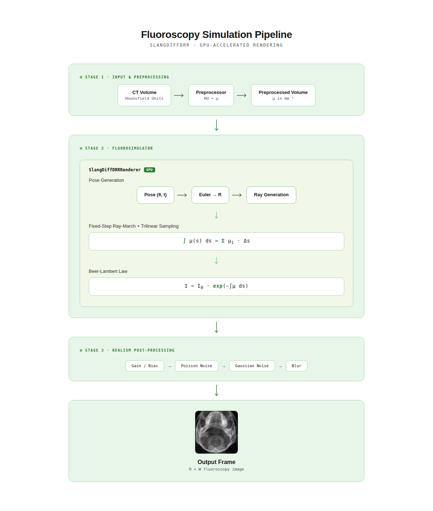

# Architecture, API & Configuration

This document covers the fluoroscopy simulator's architecture, API reference, and configuration options.

## Table of Contents

1. [Architecture](#architecture)
2. [API Reference](#api-reference)
3. [Configuration](#configuration)

---

## Architecture

### Rendering Pipeline



### Physics Model

**Beer-Lambert Law:**

The simulator computes X-ray attenuation using the Beer-Lambert law:

```text
I(x, y) = I₀ · exp(−∫ μ(s) ds)
```

Where:

- `I(x, y)` = pixel intensity at detector position (x, y)
- `I₀` = unattenuated beam intensity (source intensity)
- `μ(s)` = linear attenuation coefficient along ray path (mm⁻¹)
- `∫ μ(s) ds` = line integral through volume (ray-marching)

**Ray-Marching (fixed-step with trilinear interpolation):**

Each detector pixel corresponds to a ray from the X-ray source through the volume:

1. Compute ray origin (source position) and direction (to detector pixel)
2. Transform ray by C-arm pose (rotation + translation)
3. Compute ray-box intersection with volume bounding box (slab method)
4. March along ray in **uniform fixed steps** (`step_mm`, default 0.5 mm)
5. Sample μ-volume using **trilinear interpolation** at each step
6. Accumulate line integral (Riemann sum): `∫μ ds ≈ Σ μ(pᵢ) · Δs`
7. Apply Beer-Lambert: `I = I₀ · exp(−Σμ·Δs)`

> **Note:** The step size (`step_mm`) controls accuracy vs. performance — smaller steps are more accurate but slower.

### Differentiable Rendering

The Slang shader provides **exact gradients** via compiler-level automatic differentiation:

```python
# Forward pass only
image = renderer.render(rotation, translation)

# Forward + backward (gradient computation)
image, grads = renderer.render_with_gradients(
    rotation=[0.1, 0, 0],
    translation=[0, 0, 0],
    grad_output=upstream_gradient,  # ∂L/∂I
)
# grads = {'rotation': ∂L/∂θ, 'translation': ∂L/∂t}
```

**PyTorch Integration:**

```python
from fluorosim.rendering.diffdrr_slang_renderer import TorchSlangDiffDRR

drr = TorchSlangDiffDRR(mu_volume, spacing_zyx_mm)
rot = torch.tensor([0., 0., 0.], requires_grad=True)
trans = torch.tensor([0., 0., 0.], requires_grad=True)

image = drr(rot, trans)
loss = (image - target).pow(2).mean()
loss.backward()  # Gradients computed via Slang autodiff

print(rot.grad)    # ∂L/∂rotation
print(trans.grad)  # ∂L/∂translation
```

---

## API Reference

### Core Classes

| Class | Description |
| ----- | ----------- |
| `VolumePreprocessor` | Load CT (DICOM/NIfTI/NumPy) and convert HU → μ |
| `PreprocessedVolume` | Container for μ-volume ready for rendering |
| `VolumeMetadata` | Volume metadata (shape, spacing, HU/μ ranges) |
| `FluoroSimulator` | Main simulator class for rendering |
| `Pose` | 6-DOF C-arm pose (rotation + translation) |
| `Frame` | Single rendered frame with image and metadata |
| `CineSequence` | Collection of frames from `render_cine()` |
| `SimulatorMetrics` | Performance metrics (FPS, jitter, GPU memory) |

### Configuration Classes

| Class | Description |
| ----- | ----------- |
| `SimulatorConfig` | Top-level config bundling geometry, physics, realism |
| `CarmGeometry` | C-arm geometry (SDD, SID, detector size, pixel spacing) |
| `XrayPhysics` | X-ray physics (step size, intensity, normalization) |
| `RealismSettings` | Post-processing (noise, blur, gain/bias) |
| `OutputSettings` | Output options (save to disk, format, directory) |
| `MetricsSettings` | Performance tracking options |
| `PreprocessingSettings` | HU clipping and mapping settings |
| `HuToMuMapping` | HU → μ linear mapping parameters |

### Key Methods

**VolumePreprocessor:**

| Method | Description |
| ------ | ----------- |
| `from_dicom(path)` | Load DICOM series from directory |
| `from_nifti(path)` | Load NIfTI file (.nii or .nii.gz) |
| `from_numpy(array, spacing)` | Create from numpy array |
| `preprocess(output_dir=None)` | Run HU→μ conversion, optionally save to disk |

**FluoroSimulator:**

| Method | Description |
| ------ | ----------- |
| `render_frame(rotation, translation)` | Render single frame at pose |
| `render_cine(poses, fps)` | Render sequence of frames |
| `stream(pose_generator, max_frames)` | Stream frames from pose iterator |
| `get_metrics()` | Get performance metrics (FPS, jitter) |

**Frame:**

| Property/Method | Description |
| --------------- | ----------- |
| `image` | Rendered image as numpy array (H, W), float32 in [0, 1] |
| `pose` | Pose at which frame was rendered |
| `save(path)` | Save to PNG or NPY file |

**CineSequence:**

| Method | Description |
| ------ | ----------- |
| `save_all(dir, format)` | Save all frames to directory |
| `to_numpy()` | Return all frames as (N, H, W) array |

---

## Configuration

### SimulatorConfig

```python
from fluorosim import SimulatorConfig, CarmGeometry, XrayPhysics, RealismSettings

config = SimulatorConfig(
    geometry=CarmGeometry(
        detector_width_px=512,          # Detector width in pixels
        detector_height_px=512,         # Detector height in pixels
        pixel_spacing_mm=0.5,           # Physical pixel size (mm)
        source_to_detector_mm=1020.0,   # SDD: source to detector distance
        source_to_isocenter_mm=510.0,   # SID: source to isocenter distance
    ),
    physics=XrayPhysics(
        step_mm=0.5,                    # Ray-march step size (smaller = more accurate)
        i0=1.0,                         # Unattenuated intensity
        normalize=True,                 # Normalize output to [0, 1]
        invert=True,                    # Clinical convention: bone=white, air=black
    ),
    realism=RealismSettings(
        enabled=True,                   # Enable post-processing
        gain=1.0,                       # Intensity scaling
        bias=0.0,                       # Intensity offset
        poisson_photons=0.0,            # Poisson noise (0=disabled)
        gaussian_sigma=0.02,            # Gaussian noise sigma
        blur_sigma_px=0.5,              # Gaussian blur sigma in pixels
        seed=0,                         # Random seed for reproducibility
    ),
    backend="slang",                    # Rendering backend
)
```

> ⚠️ **Performance Note:** Enabling realism post-processing (noise, blur) significantly reduces FPS. For maximum throughput, set `enabled=False` during development or when raw projections are sufficient.

### C-arm Geometry Reference

Different C-arm vendors have distinct geometry specifications:

| Vendor/Model | SDD (mm) | SID (mm) | Detector | Pixel (mm) |
| ------------ | -------- | -------- | -------- | ---------- |
| GE OEC 9900 | 1020 | 510 | 1024×1024 | 0.194 |
| GE OEC Elite CFD | 1150 | 575 | 1920×1920 | 0.154 |
| GE Innova IGS 540 | 1200 | 750 | 2048×2048 | 0.200 |
| Siemens Arcadis Avantic | 1000 | 500 | 1024×1024 | 0.195 |
| Siemens Cios Alpha | 1100 | 550 | 1536×1536 | 0.178 |
| Siemens Artis zee | 1250 | 780 | 2480×1920 | 0.154 |
| Philips BV Pulsera | 990 | 495 | 1024×1024 | 0.200 |
| Philips Azurion 7 | 1240 | 780 | 2480×1920 | 0.154 |
| Ziehm Vision RFD 3D | 1000 | 500 | 1024×1024 | 0.194 |

**Example vendor configuration:**

```python
# GE OEC 9900 Mobile C-arm
geometry = CarmGeometry(
    source_to_detector_mm=1020.0,
    source_to_isocenter_mm=510.0,
    detector_width_px=1024,
    detector_height_px=1024,
    pixel_spacing_mm=0.194,
)

# Siemens Artis zee (fixed biplane angiography)
geometry = CarmGeometry(
    source_to_detector_mm=1250.0,
    source_to_isocenter_mm=780.0,
    detector_width_px=2480,
    detector_height_px=1920,
    pixel_spacing_mm=0.154,
)
```
