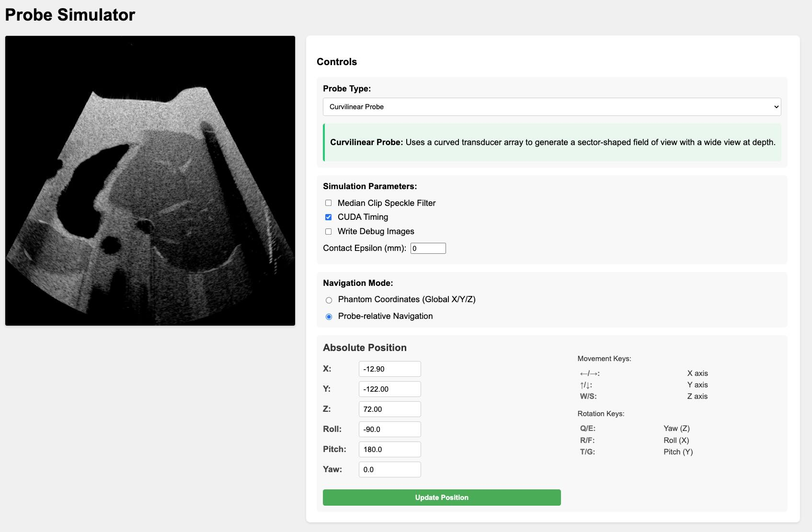

# Raytracing Ultrasound Simulator

A high-performance GPU-accelerated ultrasound simulator using NVIDIA OptiX raytracing.
This simulator leverages cutting-edge raytracing technology to generate realistic ultrasound images in real-time, enabling researchers and developers to create synthetic training data, test imaging algorithms, and prototype new ultrasound applications. By simulating the physics of ultrasound wave propagation and tissue interaction, it provides accurate and customizable ultrasound imaging without the need for physical phantoms or patient data.

## Features

- GPU acceleration with CUDA and NVIDIA OptiX
- Python interface for ease of use
- Real-time simulation capabilities
- Support for curvilinear, linear, and phased array ultrasound probe simulation

## Requirements

- [CUDA 12.6+](https://docs.nvidia.com/cuda/cuda-quick-start-guide/index.html#)
- [NVIDIA Driver 555+](https://www.nvidia.com/en-us/drivers/)
- [CMake 3.24+](https://cmake.org/)
- [NVIDIA OptiX SDK 8.1](https://developer.nvidia.com/designworks/optix/downloads/legacy)

## Quick start

### Option 1: Using the I4H CLI (Recommended)

The `./i4h` CLI builds and runs inside a Docker container with all dependencies pre-installed.

```bash
# Launch the interactive web server (default mode)
./i4h run ultrasound-raytracing

# Run the sphere-sweep demo (no mesh download needed)
./i4h run ultrasound-raytracing sphere_sweep

# Run the liver-sweep demo
./i4h run ultrasound-raytracing liver_sweep

# Run the performance benchmark
./i4h run ultrasound-raytracing benchmark

# List available modes
./i4h modes ultrasound-raytracing

# Launch an interactive shell inside the container
./i4h run-container ultrasound-raytracing
```

Open your browser to <http://0.0.0.0:8000> when running the `server` mode.

> **Note:** With `./i4h`, mesh-backed modes (`server`, `liver_sweep`, `benchmark`) use the default
> container mesh path (`/opt/ultrasound-mesh`) automatically.
> `sphere_sweep` does not use mesh assets.



### Option 2: Using build_and_run.sh

```bash
cd ultrasound-raytracing
./build_and_run.sh examples/server.py
```

### Option 3: Docker

Instructions to build and run the examples in a docker environment can be found in the [`docs/docker_build`](docs/docker_build.md).

### Option 4: Bare-Metal Installation

Instructions to build and run the examples on a bare-metal installation can be found in the [`docs/baremetal_build`](docs/baremetal_build.md).

## Start Simulating

For a comprehensive guide on using the simulator, understanding its features, and exploring advanced topics, please refer to our documentation:

- **[Getting Started Guide](./docs/ultrasound_simulator_getting_started.md)**: A step-by-step tutorial for beginners.
- **[Technical Guide](./docs/ultrasound_simulator_technical_guide.md)**: An in-depth look at the physics and implementation details.

## Benchmark Results

To reproduce these results, run `python examples/benchmark.py`.

```text
Benchmark Results:
        Total frames: 200
        Average frame time: 0.0073 seconds
        Average FPS: 136.28
        Minimum FPS: 59.66
        Maximum FPS: 249.62
        Date: 2025-03-16 07:38:46

        System Information:
        GPU: NVIDIA RTX 6000 Ada Generation (48.0 GB, Driver: 565.57.01)
        CPU: AMD Ryzen Threadripper PRO 7975WX 32-Cores (64 cores)

```
