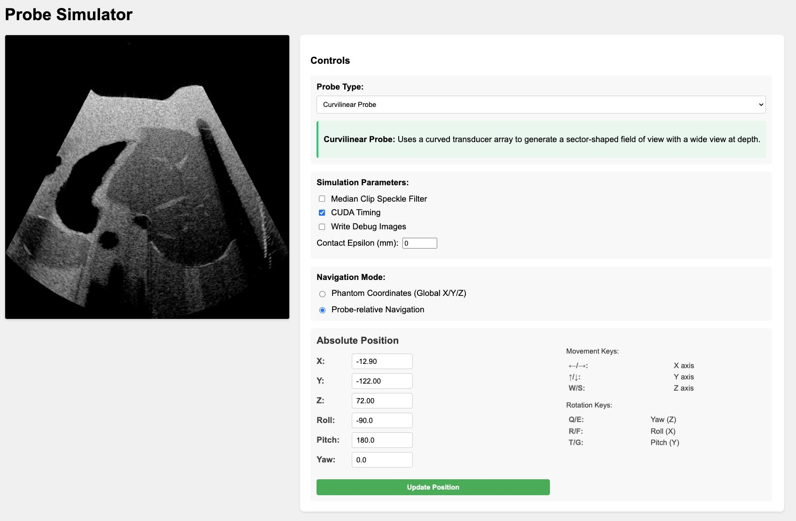

# Raytracing Ultrasound Simulator

A high-performance GPU-accelerated ultrasound simulator using NVIDIA OptiX raytracing.
This simulator leverages cutting-edge raytracing technology to generate realistic ultrasound images in real-time, enabling researchers and developers to create synthetic training data, test imaging algorithms, and prototype new ultrasound applications. By simulating the physics of ultrasound wave propagation and tissue interaction, it provides accurate and customizable ultrasound imaging without the need for physical phantoms or patient data.

## Features

- GPU acceleration with CUDA and NVIDIA OptiX
- Python interface for ease of use
- Real-time simulation capabilities
- Support for curvilinear, linear, phased array, and radial ultrasound probe simulation

## Requirements

- [CUDA 12.6+](https://docs.nvidia.com/cuda/cuda-quick-start-guide/index.html#)
- [NVIDIA Driver 555+](https://www.nvidia.com/en-us/drivers/)
- [CMake 3.24+](https://cmake.org/)
- [NVIDIA OptiX SDK 8.1](https://developer.nvidia.com/designworks/optix/downloads/legacy)

## Quick start

### Option 1: Using the I4H CLI (Recommended)

The `./i4h` CLI builds and runs inside a Docker container with all dependencies pre-installed.

```bash
# Launch the interactive web server (default mode)
./i4h run ultrasound-raytracing

# Run the sphere-sweep demo (no mesh download needed)
./i4h run ultrasound-raytracing sphere_sweep

# Run the liver-sweep demo
./i4h run ultrasound-raytracing liver_sweep

# Run the performance benchmark
./i4h run ultrasound-raytracing benchmark

# Validate radial geometry and benchmark IVUS/R-EBUS acquisition (no mesh assets needed)
./i4h run ultrasound-raytracing radial_benchmark

# List available modes
./i4h modes ultrasound-raytracing

# Launch an interactive shell inside the container
./i4h run-container ultrasound-raytracing
```

Open your browser to <http://0.0.0.0:8000> when running the `server` mode.

> **Note:** With `./i4h`, mesh-backed modes (`server`, `liver_sweep`, `benchmark`) use the default
> container mesh path (`/opt/ultrasound-mesh`) automatically.
> `sphere_sweep` and `radial_benchmark` do not use mesh assets.



### Option 2: Using build_and_run.sh

```bash
cd ultrasound-raytracing
./build_and_run.sh examples/server.py
```

### Option 3: Docker

Instructions to build and run the examples in a docker environment can be found in the [`docs/docker_build`](docs/docker_build.md).

### Option 4: Bare-Metal Installation

Instructions to build and run the examples on a bare-metal installation can be found in the [`docs/baremetal_build`](docs/baremetal_build.md).

## Start Simulating

For a comprehensive guide on using the simulator, understanding its features, and exploring advanced topics, please refer to our documentation:

- **[Getting Started Guide](./docs/ultrasound_simulator_getting_started.md)**: A step-by-step tutorial for beginners.
- **[Technical Guide](./docs/ultrasound_simulator_technical_guide.md)**: An in-depth look at the physics and implementation details.

## Radial IVUS and R-EBUS geometry

`RadialProbe` models the rotating, single-element geometry used for IVUS and R-EBUS. It acquires
$N$ A-lines over one full turn. In the probe's local frame, `+y` follows the catheter axis and
A-line zero points along `+z`; `Pose` then places that frame in the scene.

For A-line $i \in \{0, \ldots, N-1\}$,

$$
\begin{aligned}
\theta_i &= \theta_0 + s\,\frac{2\pi i}{N}, \\
\mathbf{o}_i &= r_o(\sin\theta_i,\ 0,\ \cos\theta_i), \\
\mathbf{d}_i &=
(\cos\beta\sin\theta_i,\ \sin\beta,\ \cos\beta\cos\theta_i).
\end{aligned}
$$

Here, $\theta_0$ is the start angle, $s$ is `+1` or `-1` for the acquisition direction,
$r_o$ is `transducer_offset_radius`, and $\beta$ is `beam_tilt`. Positive rotation runs from
`+z` towards `+x`; negative rotation reverses the order. The half-open sequence covers the full
turn without acquiring the seam twice. The equations use radians, while the API accepts angles in
degrees.

```python
import raysim.cuda as rs

probe = rs.RadialProbe(
    num_scanlines=512,
    dead_zone_radius=0.75,
    rotation_period=1.0 / 30.0,
    transducer_offset_radius=0.2,
    beam_tilt=5.0,
    rotation_direction=rs.RadialRotationDirection.NEGATIVE,
)
```

Distances are in millimetres and `rotation_period` is in seconds. Setting $r_o=\beta=0$ gives a
centred, transverse sweep.

Scan conversion maps each output point $(x,z)$ into catheter-centred polar coordinates:

$$
\begin{aligned}
r &= \sqrt{x^2+z^2}, &
\phi &= \operatorname{atan2}(x,z), \\
u_r &= \frac{r}{R}, &
u_\theta &= \operatorname{wrap}
\left(s\,\frac{\phi-\theta_0}{2\pi}\right),
\end{aligned}
$$

where $R$ is the maximum imaging range and
$\operatorname{wrap}(q)=q-\lfloor q\rfloor$. Pixels are sampled only when
$r_d \le r \le R$, with $r_d$ set by `dead_zone_radius`; this produces the central cut-out.
Angular interpolation is periodic across the seam.

For an eccentric or tilted emitter, range is measured from $\mathbf{o}_i$ along
$\mathbf{d}_i$, while the image remains centred on the catheter axis. Scan conversion deliberately
leaves that mismatch visible rather than correcting it, preserving the resulting geometric
distortion.

For a rotation period $T$, the acquisition timestamp is

$$
t_i = T\frac{i}{N}.
$$

The final A-line therefore occurs before $T$, consistently with the half-open turn. These
timestamps describe acquisition order; they do not advance scene motion automatically.

The offset-and-tilt model follows published treatments of
[IVUS geometric artefacts](https://pubmed.ncbi.nlm.nih.gov/10386732/) and
[R-EBUS simulation geometry](https://pmc.ncbi.nlm.nih.gov/articles/PMC9927880/). Its parameters
describe generic mechanics rather than calibration data for a particular catheter.

## Benchmark Results

### General benchmark

To reproduce these results, run `python examples/benchmark.py`.

```text
Benchmark Results:
        Total frames: 200
        Average frame time: 0.0073 seconds
        Average FPS: 136.28
        Minimum FPS: 59.66
        Maximum FPS: 249.62
        Date: 2025-03-16 07:38:46

        System Information:
        GPU: NVIDIA RTX 6000 Ada Generation (48.0 GB, Driver: 565.57.01)
        CPU: AMD Ryzen Threadripper PRO 7975WX 32-Cores (64 cores)

```

### Radial benchmark

For the radial probe, run `python examples/radial_probe_benchmark.py`. The self-contained benchmark
uses four overlapping spheres to form centred and asymmetric reflector shells, allowing each
detected range to be checked against an analytic ray-sphere intersection. It tests both acquisition
directions and reports geometric error, seam continuity, timestamp accuracy, end-to-end latency,
A-line throughput and returned payload size. The timed call includes all returned data and writes no
images or other artefacts.
