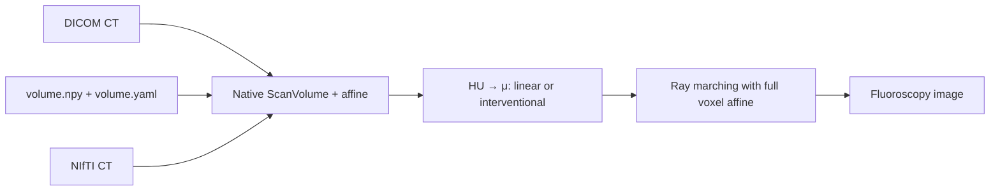

# X-ray Simulator

GPU-accelerated fluoroscopy (X-ray) simulation from CT volumes using differentiable ray marching.

## HU input and attenuation presets

DICOM CT and patient bundle `volume.yaml` inputs use the same full-affine path.
This library owns HU → μ conversion and the internal LPS/mm rendering adapter;
arrays do not need to be flipped or resampled by callers.



```python
from xray_simulator import HuToMuMapping, PreprocessingSettings, VolumePreprocessor
from xray_simulator.scan_volume import Conversion, export_ct, replay

conversion = Conversion(world_frame="RAS", world_unit="m", array_axes="kji")
recipe = export_ct("dicom/", "ct_artifact", options=conversion)
settings = PreprocessingSettings(hu_to_mu=HuToMuMapping.preset("interventional"))

# Equivalent volumes; use either as the simulator input.
volume = VolumePreprocessor.from_dicom(
    "dicom/", conversion=conversion, settings=settings,
).preprocess()
from_bundle = VolumePreprocessor.from_artifact(recipe, settings=settings).preprocess()
replay(recipe, "dicom/", "reproduced_ct")
```

Install `[dicom]` for regular single-frame DICOM CT or `[nifti]` for NIfTI.
Select `series_uid=` if a DICOM directory contains multiple series. The copied
`scan_volume` helper is identical to patient-digital-twin's helper. Its YAML records
source hashes, conversion options, array axes, physical frame/units, full affines,
and versions. Defaults preserve spacing and origin; `spacing_ijk_mm=(...)`
explicitly requests resampling, and `origin="source_center"` requests centering.
Irregular stacks and enhanced multi-frame DICOM need explicit prior conversion.

With the same conversion, attenuation, C-arm pose, and display/noise settings,
direct DICOM and its saved artifact produce the same image. Oblique geometry is
handled by the affine during ray marching; no canonical-array conversion is required.

`linear` is the default: −1000–3000 HU → 0–0.02 mm⁻¹. `interventional` uses
piecewise-linear tissue/contrast/implant control points through 8000 HU →
0.044 mm⁻¹. Both clamp outside their endpoint knots. Custom
`HuToMuMapping(control_points=...)` remains supported. HU pre-clipping is off by default.
The spacing-only `from_numpy` API remains available; use `scan_volume.from_array`
with `VolumePreprocessor.from_scan` when the array has a full physical affine.

## Overview

The `xray_simulator` package generates realistic simulated X-ray images from CT volumes using Beer-Lambert physics and GPU-accelerated rendering via NVIDIA Slang with automatic differentiation.

**Key Capabilities:**

- Generate Digitally Reconstructed Radiographs (DRRs) from CT volumes at arbitrary C-arm poses
- Compute exact gradients for 2D/3D registration via Slang's compiler-level autodiff
- Achieve real-time performance (~150+ FPS on RTX A6000)


*C-arm sweep animation showing the virtual X-ray source (SRC), detector (DET), and simulated fluoroscopy output in real-time.*

---

## Table of Contents

1. [Installation](#installation)
2. [Quick Start](#quick-start)
3. [Architecture, API & Configuration](docs/architecture-and-api.md) — rendering pipeline, physics, API reference, C-arm configuration
4. [Examples & Test Data](docs/examples-and-test-data.md) — test datasets, example scripts, running the examples

---

## Installation

### Option 1: Using the I4H CLI (Recommended)

The `./i4h` CLI builds and runs inside a Docker container with all dependencies pre-installed.
Each step is a separate mode; the cached preprocessed volume persists between runs in `xray-simulator/output/`.

```bash
# Synthetic data workflow (no real CT data needed)
./i4h run xray-simulator preprocess_synthetic
./i4h run xray-simulator demo

# Real CT data workflow
./i4h run xray-simulator download_data
./i4h run xray-simulator preprocess_dicom
./i4h run xray-simulator demo

# List available modes
./i4h modes xray-simulator

# Launch an interactive shell inside the container
./i4h run-container xray-simulator
```

Set `xray_simulator_OUTPUT_DIR` or `xray_simulator_CACHE_DIR` to override the default output paths.

### Option 2: Docker

```bash
cd xray-simulator

# Build the Docker image
docker build -t xray_simulator  .

# Run the container
docker run -it --rm --gpus all xray_simulator bash

# Inside the container
# Run the synthetic demo
python examples/preprocess_ct.py --synthetic
python examples/xray_simulator_demo.py

# Run the demo with real CT data
# Download the dataset
kaggle datasets download -d adamhuan/multiphase-ct-anigography-2-datasets
unzip multiphase-ct-anigography-2-datasets.zip
python examples/preprocess_ct.py --dicom excellent/excellent/0
python examples/xray_simulator_demo.py
```

### Option 3: Bare Metal Installation

```bash
cd xray-simulator
pip install -e .[all]
```

**Requirements:**

| Dependency | Purpose |
| ---------- | ------- |
| CUDA-capable GPU | GPU-accelerated rendering |
| `slangpy >= 0.40` | Slang shader compilation and autodiff |
| `numpy` | Array operations |
| `SimpleITK` | DICOM/NIfTI loading (optional) |
| `torch` | PyTorch integration for autograd (optional) |

---

## Quick Start

```python
from xray_simulator import VolumePreprocessor, xray_simulator, SimulatorConfig, PreprocessedVolume

# Step 1: Preprocess CT volume (HU → μ conversion)
volume = VolumePreprocessor.from_nifti("ct.nii.gz").preprocess()

# Step 2: Create simulator and render
simulator = xray_simulator(volume)
frame = simulator.render_frame(rotation=(0, 0.5, 0))  # 0.5 rad Y rotation

# Step 3: Save result
frame.save("output.png")
```

### Step-by-Step Explanation

### Step 1: Volume Preprocessing

CT volumes store tissue density in Hounsfield Units (HU). The `VolumePreprocessor` converts these to linear attenuation coefficients (μ in mm⁻¹) using a linear mapping:

```text
μ = μ_min + (HU - HU_min) / (HU_max - HU_min) × (μ_max - μ_min)
```

Default mapping: HU ∈ [-1000, 3000] → μ ∈ [0.0, 0.02] mm⁻¹

```python
# Load from various sources
volume = VolumePreprocessor.from_dicom("/path/to/dicom/").preprocess()
volume = VolumePreprocessor.from_nifti("ct.nii.gz").preprocess()
volume = VolumePreprocessor.from_numpy(hu_array, spacing_zyx_mm=(1.0, 0.5, 0.5)).preprocess()

# Cache to disk for fast reloading
volume = preprocessor.preprocess(output_dir="/tmp/xray_cache")

# Reload cached volume
volume = PreprocessedVolume.load("/tmp/xray_cache")
```

### Step 2: Simulator Initialization

The `xray_simulator` initializes the GPU rendering pipeline:

```python
simulator = xray_simulator(volume, config=SimulatorConfig())
```

- uploads μ-volume to GPU as a 3D texture with trilinear interpolation
- compiles Slang shader with autodiff enabled
- configures virtual C-arm geometry (source, detector, isocenter)

### Step 3: Frame Rendering

Render a single X-ray frame at a specified C-arm pose:

```python
from xray_simulator import Pose

# Clinical views, by name or by C-arm angles
frame = simulator.render_frame(pose=Pose.ap())
frame = simulator.render_frame(pose=Pose.lateral("left"))
frame = simulator.render_frame(pose=Pose.from_clinical_angles(30.0, 20.0))  # LAO 30 / CRAN 20

# Or a raw pose, in the renderer's own frame
frame = simulator.render_frame(
    rotation=(rx, ry, rz),      # Euler angles in radians, ZXY convention
    translation=(tx, ty, tz),   # Isocenter offset in mm
)
```

The presets use physical LPS coordinates (`+X` Left, `+Y` Posterior, `+Z` Superior).
The DICOM, NIfTI, and artifact adapters supply this frame internally and record it
in `metadata.anatomical_frame`, preserving the acquired array grid. All of them put the head at the top of the image; AP shows the
patient's left on the viewer's right, and the laterals are named by the side the detector is
on.

Raw Euler angles have no anatomical meaning on their own, and the identity pose is an axial
projection rather than a radiographic view. See
[World Frame and Pose Convention](docs/architecture-and-api.md#world-frame-and-pose-convention)
for the axis and rotation conventions, and for how to aim the isocenter at a patient-space
point.

### Step 4: Image Appearance

Rendering yields intensity `I = i0 · exp(-∫μ ds)`, and `DisplaySettings` decides how that
becomes pixels. There are two modes, and they differ only in which way round the greys go:

| Mode | Preset | Dense structures | Looks like |
| --- | --- | --- | --- |
| Fluoroscopy (default) | `"fluoro"` | dark on a bright background | a live cath-lab monitor |
| X-ray | `"xray"` | bright on a dark background | a diagnostic radiograph / DRR |

```python
from xray_simulator import Pose, SimulatorConfig, xray_simulator

# Fluoroscopy, the default
simulator = xray_simulator(volume, SimulatorConfig.for_appearance("fluoro"))

# X-ray images instead
simulator = xray_simulator(volume, SimulatorConfig.for_appearance("xray"))

simulator.calibrate_display()   # fit the log window to this patient, once
```

Both modes come off the same render, so you can switch whenever you like — including partway
through a session, or after a frame has already been rendered:

```python
simulator.set_polarity("xray")     # flip modes, keeping the calibrated window
simulator.set_appearance("fluoro") # or load a whole preset (replaces the window too)

# Or keep the intensity and produce both looks from one render
simulator = xray_simulator(volume, SimulatorConfig
                           .for_appearance("fluoro")
                           .with_output(keep_intensity=True))
frame = simulator.render_frame(pose=Pose.ap())
frame.save("fluoro.png")
frame.with_appearance("xray").save("xray.png")   # same photons, other polarity
```

Both modes map intensity logarithmically, like a real detector chain, using a mapping that is
identical for every frame so brightness stays stable while the C-arm moves. Calibrating is worth
the one extra frame: the useful attenuation range depends on patient size and μ scaling, so the
default window is a compromise. `calibrate_display()` measures it once and then holds it fixed,
which is what distinguishes it from per-frame normalization (`scaling="per_frame"`), where
brightness follows whatever is in the field of view and cine sequences flicker.

`"diagnostic"` is accepted as a synonym for `"xray"`, and `"fluoro_contrast"` is fluoroscopy over
a narrower window for more soft-tissue and contrast separation. The old `physics.normalize` /
`physics.invert` flags still work and warn; together they are the `"legacy"` preset. See
[Image Appearance](docs/architecture-and-api.md#image-appearance) for the full table.

### Step 5: Output

```python
# Access rendered image as numpy array
image = frame.image  # Shape: (H, W), dtype: float32, range: [0, 1]

# Save to disk
frame.save("output.png")  # 8-bit grayscale PNG
frame.save("output.npy")  # Full-precision numpy
```

### Rendering Multiple Frames (Cine Sequence)

```python
from xray_simulator import Pose

# Generate a LAO/RAO sweep animation
poses = [
    Pose.from_clinical_angles(primary_deg=angle)
    for angle in range(-30, 31, 2)  # RAO 30 through LAO 30 in 2° steps
]

cine = simulator.render_cine(poses, fps=15.0)
cine.save_all("/tmp/output", format="png")  # frame_0000.png, frame_0001.png, ...

# Access as numpy array
frames_array = cine.to_numpy()  # Shape: (N, H, W)
```

---

## Further Reading

- **[Architecture, API & Configuration](docs/architecture-and-api.md)** — Physics model, differentiable rendering, full API reference, and C-arm geometry configuration.
- **[Examples & Test Data](docs/examples-and-test-data.md)** — Recommended datasets (e.g. Kaggle), command-line examples, single-frame/cine/streaming code, and step-by-step instructions for `preprocess_ct.py` and `xray_simulator_demo.py`.
