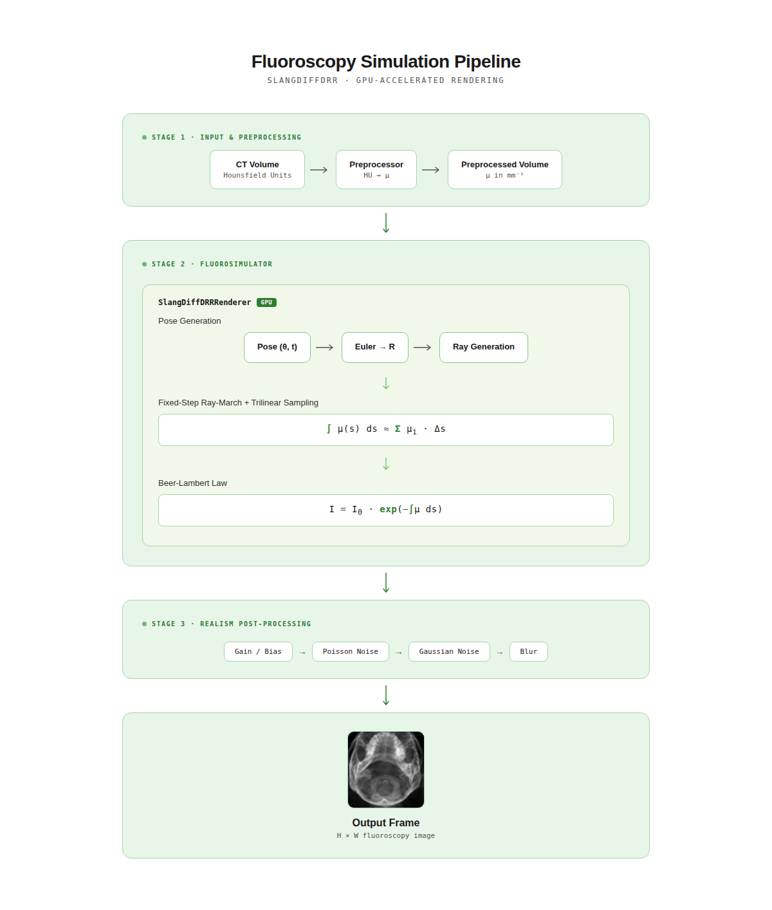

# Architecture, API & Configuration

This document covers the fluoroscopy simulator's architecture, API reference, and configuration options.

## Table of Contents

1. [Architecture](#architecture)
2. [API Reference](#api-reference)
3. [Configuration](#configuration)

---

## Architecture

### Rendering Pipeline



### Physics Model

**Beer-Lambert Law:**

The simulator computes X-ray attenuation using the Beer-Lambert law:

```text
I(x, y) = I₀ · exp(−∫ μ(s) ds)
```

Where:

- `I(x, y)` = pixel intensity at detector position (x, y)
- `I₀` = unattenuated beam intensity (source intensity)
- `μ(s)` = linear attenuation coefficient along ray path (mm⁻¹)
- `∫ μ(s) ds` = line integral through volume (ray-marching)

**Ray-Marching (fixed-step with trilinear interpolation):**

Each detector pixel corresponds to a ray from the X-ray source through the volume:

1. Compute ray origin (source position) and direction (to detector pixel)
2. Transform ray by C-arm pose (rotation + translation)
3. Compute ray-box intersection with volume bounding box (slab method)
4. March along ray in **uniform fixed steps** (`step_mm`, default 0.5 mm)
5. Sample μ-volume using **trilinear interpolation** at each step
6. Accumulate line integral (Riemann sum): `∫μ ds ≈ Σ μ(pᵢ) · Δs`
7. Apply Beer-Lambert: `I = I₀ · exp(−Σμ·Δs)`

> **Note:** The step size (`step_mm`) controls accuracy vs. performance — smaller steps are more accurate but slower.

### World Frame and Pose Convention

The renderer works in millimeters. Array axis 2 maps to world X, axis 1 to world Y and axis
0 to world Z. When the volume has been reoriented to the canonical patient frame by the
digital-twin preprocessing (`metadata.anatomical_frame == "LPS"`), those axes have anatomical
meaning:

| World axis | Patient direction | Volume array axis |
| ---------- | ----------------- | ----------------- |
| +X | Left | axis 2 (columns) |
| +Y | Posterior (back) | axis 1 |
| +Z | Superior (head) | axis 0 (slices) |

A pose is Euler angles `(rx, ry, rz)` in radians plus a translation in mm, in the shader's
ZXY convention `R = Rz · Rx · Ry`. `R` maps the C-arm frame to the world, and its columns are
what matter in practice:

| Column of `R` | C-arm axis | Meaning |
| ------------- | ---------- | ------- |
| 0 | local +X | patient direction that increasing image **column** moves toward |
| 1 | local +Y | patient direction that increasing image **row** moves toward |
| 2 | local +Z | direction the **beam travels**, source to detector |

Images are stored row 0 first and displayed top-down, so column 1 pointing Inferior is what
puts the head at the top of the image.

> ⚠️ The identity pose `(0, 0, 0)` sends the beam along world +Z, which for a canonical
> volume is an axial projection down the patient's long axis, not a radiographic view. It is
> kept that way so existing saved poses still render the same thing. Use the presets below
> rather than hand-written angles.

**View presets:**

```python
from xray_simulator import Pose

simulator.render_frame(pose=Pose.ap())                # beam front to back
simulator.render_frame(pose=Pose.pa())                # beam back to front (tube under table)
simulator.render_frame(pose=Pose.lateral("left"))     # detector on the patient's left
simulator.render_frame(pose=Pose.from_clinical_angles(30.0, 20.0))  # LAO 30 / CRAN 20
```

All four views put the head at the top of the image. AP shows the patient's left on the
viewer's right, PA is the mirror of that since it is seen from behind, and the laterals are
named by the side the detector is on.

`from_clinical_angles` follows the cath-lab convention, anchored on the PA view (tube below a
supine patient): the primary angle is LAO/RAO, positive toward LAO, and the secondary angle
is CRAN/CAUD, positive toward cranial. Both are rotations in the patient frame, composed as
`R = Rz(primary) · Rx(−secondary) · R_pa`. `pose.clinical_angles()` reports any pose back in
those terms.

Because a view label is only meaningful for a volume in the canonical frame, rendering a
labeled pose against a volume whose `anatomical_frame` is unset raises a `UserWarning` once
per simulator. Preprocess with the digital twin to get the frame recorded, or pass
`anatomical_frame="LPS"` to `VolumePreprocessor` if you already know the data is canonical.

**Isocenter:** the C-arm rotates about the center of the volume bounding box, and the pose
translation displaces it from there. To aim at a patient-space point such as a centerline
vertex, use `simulator.isocenter_translation(point_xyz_mm)`. Positions are in the same frame
as `metadata.origin_xyz_mm`, which is now passed through to the shader, so the render happens
in patient coordinates rather than at an assumed origin of zero.

**Projecting a known point:** `project_point_to_detector()` gives the pixel a world point
lands on under a pose, using the same cone-beam geometry as the shader. It runs on the CPU
and is the basis of the pose convention tests in `tests/test_geometry.py`.

### Differentiable Rendering

The Slang shader provides **exact gradients** via compiler-level automatic differentiation:

```python
# Forward pass only
image = renderer.render(rotation, translation)

# Forward + backward (gradient computation)
image, grads = renderer.render_with_gradients(
    rotation=[0.1, 0, 0],
    translation=[0, 0, 0],
    grad_output=upstream_gradient,  # ∂L/∂I
)
# grads = {'rotation': ∂L/∂θ, 'translation': ∂L/∂t}
```

**PyTorch Integration:**

```python
from xray_simulator.rendering.diffdrr_slang_renderer import TorchSlangDiffDRR

drr = TorchSlangDiffDRR(mu_volume, spacing_zyx_mm)
rot = torch.tensor([0., 0., 0.], requires_grad=True)
trans = torch.tensor([0., 0., 0.], requires_grad=True)

image = drr(rot, trans)
loss = (image - target).pow(2).mean()
loss.backward()  # Gradients computed via Slang autodiff

print(rot.grad)    # ∂L/∂rotation
print(trans.grad)  # ∂L/∂translation
```

---

## API Reference

### Core Classes

| Class | Description |
| ----- | ----------- |
| `VolumePreprocessor` | Load CT (DICOM/NIfTI/NumPy) and convert HU → μ |
| `PreprocessedVolume` | Container for μ-volume ready for rendering |
| `VolumeMetadata` | Volume metadata (shape, spacing, HU/μ ranges) |
| `xray_simulator` | Main simulator class for rendering |
| `Pose` | 6-DOF C-arm pose (rotation + translation), with clinical view presets |
| `Frame` | Single rendered frame with image and metadata |
| `CineSequence` | Collection of frames from `render_cine()` |
| `SimulatorMetrics` | Performance metrics (FPS, jitter, GPU memory) |

### Configuration Classes

| Class | Description |
| ----- | ----------- |
| `SimulatorConfig` | Top-level config bundling geometry, physics, realism |
| `CarmGeometry` | C-arm geometry (SDD, SID, detector size, pixel spacing) |
| `XrayPhysics` | X-ray physics (step size, intensity, normalization) |
| `RealismSettings` | Post-processing (noise, blur, gain/bias) |
| `OutputSettings` | Output options (save to disk, format, directory) |
| `MetricsSettings` | Performance tracking options |
| `PreprocessingSettings` | HU clipping and mapping settings |
| `HuToMuMapping` | Piecewise-linear HU → μ transfer function (window/level) |

### Key Methods

**VolumePreprocessor:**

| Method | Description |
| ------ | ----------- |
| `from_dicom(path)` | Load DICOM series from directory |
| `from_nifti(path)` | Load NIfTI file (.nii or .nii.gz) |
| `from_numpy(array, spacing)` | Create from numpy array |
| `with_hu_to_mu(mapping)` | Swap the HU → μ mapping, reusing the loaded HU volume |
| `preprocess(output_dir=None)` | Run HU→μ conversion, optionally save to disk |

**xray_simulator:**

| Method | Description |
| ------ | ----------- |
| `render_frame(rotation, translation)` | Render single frame at pose |
| `render_cine(poses, fps)` | Render sequence of frames |
| `stream(pose_generator, max_frames)` | Stream frames from pose iterator |
| `get_metrics()` | Get performance metrics (FPS, jitter) |
| `isocenter_translation(point)` | Pose translation that aims the isocenter at a patient point |
| `volume_center_xyz_mm` | World position the C-arm rotates about at zero translation |
| `calibrate_display(pose=None)` | Fit the log window to one frame, then hold it fixed |
| `set_polarity(polarity)` | Switch fluoroscopy ↔ X-ray, keeping scaling and calibration |
| `set_appearance(preset)` | Replace the display settings with a preset or explicit settings |

**Pose:**

| Method | Description |
| ------ | ----------- |
| `ap()` / `pa()` | Frontal views, head up |
| `lateral(side)` | Lateral view, named by the side the detector is on |
| `from_clinical_angles(primary, secondary)` | LAO/RAO and CRAN/CAUD degrees, relative to PA |
| `clinical_angles()` | Report a pose as (LAO/RAO, CRAN/CAUD) degrees |

**Frame:**

| Method | Description |
| ------ | ----------- |
| `save(path)` | Write the frame as 8-bit PNG or full-precision `.npy` |
| `with_appearance(preset)` | Re-map the same render to another mode (needs `keep_intensity`) |

**Frame:**

| Property/Method | Description |
| --------------- | ----------- |
| `image` | Rendered image as numpy array (H, W), float32 in [0, 1] |
| `pose` | Pose at which frame was rendered |
| `save(path)` | Save to PNG or NPY file |

**CineSequence:**

| Method | Description |
| ------ | ----------- |
| `save_all(dir, format)` | Save all frames to directory |
| `to_numpy()` | Return all frames as (N, H, W) array |

---

## Configuration

### SimulatorConfig

```python
from xray_simulator import SimulatorConfig, CarmGeometry, XrayPhysics, DisplaySettings, RealismSettings

config = SimulatorConfig(
    geometry=CarmGeometry(
        detector_width_px=512,          # Detector width in pixels
        detector_height_px=512,         # Detector height in pixels
        pixel_spacing_mm=0.5,           # Physical pixel size (mm)
        source_to_detector_mm=1020.0,   # SDD: source to detector distance
        source_to_isocenter_mm=510.0,   # SID: source to isocenter distance
    ),
    physics=XrayPhysics(
        step_mm=0.5,                    # Ray-march step size (smaller = more accurate)
        i0=1.0,                         # Unattenuated intensity
    ),
    display=DisplaySettings(
        polarity="fluoro",              # Dense structures dark, as on a fluoro monitor
        scaling="transmission",         # I / i0, identical mapping for every frame
        gamma=1.0,                      # Display gamma, >1 lifts mid-greys
    ),
    realism=RealismSettings(
        enabled=True,                   # Enable post-processing
        gain=1.0,                       # Intensity scaling
        bias=0.0,                       # Intensity offset
        poisson_photons=0.0,            # Poisson noise (0=disabled)
        gaussian_sigma=0.02,            # Gaussian noise sigma
        blur_sigma_px=0.5,              # Gaussian blur sigma in pixels
        seed=0,                         # Random seed for reproducibility
    ),
    backend="slang",                    # Rendering backend
)
```

> ⚠️ **Performance Note:** Enabling realism post-processing (noise, blur) significantly reduces FPS. For maximum throughput, set `enabled=False` during development or when raw projections are sufficient.

### Image Appearance

The renderer produces intensity `I = i0 · exp(-∫μ ds)`, so dense anatomy carries less signal
than air. `DisplaySettings` turns that into pixels through two independent choices, which
used to be entangled in the `physics.normalize` / `physics.invert` flag pair.

**Polarity** decides which way round the greys go, and is the only difference between the two
modes the simulator supports. `"fluoro"` (the default) keeps the physical ordering, so bone,
contrast and instruments are dark on a bright background, the way a live fluoroscopy monitor
shows them. `"diagnostic"` inverts that for the radiograph look used in diagnostic X-ray and
most DRR literature — this is the mode to use when you want X-ray-like images, and its preset
is spelled `"xray"` as well as `"diagnostic"`.

**Scaling** decides how intensity reaches `[0, 1]`. All modes except `"per_frame"` are
frame-independent, which is what keeps brightness stable while the C-arm moves:

| Mode | Mapping | Use it when |
| --- | --- | --- |
| `"log"` | Line integral `∫μ ds = -ln(I / i0)` across `log_window` | Default. A detector chain is logarithmic, and a torso transmits only a few percent of the beam, so this is both physical and viewable. Equivalent to film optical density and linear in path length. |
| `"transmission"` | `I / i0`, clipped | The literal physical ratio, for analysis or thin phantoms. Usually far too dark to look at for a whole patient. |
| `"window"` | Stretch a transmission interval | A contrast control in transmission space. |
| `"per_frame"` | Rescale by each frame's own min/max | One-off stills only. Brightness follows whatever is in the field of view, so moving the C-arm or advancing an instrument makes the sequence flicker. |

The useful line-integral range depends on patient size and μ scaling, so any fixed default
window is a compromise. Calibrate once per volume and then leave it alone:

```python
from xray_simulator import SimulatorConfig, DisplaySettings, xray_simulator

sim = xray_simulator(volume, SimulatorConfig.for_appearance("fluoro"))
sim.calibrate_display()          # renders one AP frame, fits log_window, keeps it fixed
frames = sim.render_cine(poses)  # every frame now shares that mapping
```

That is the important distinction from per-frame normalization: the window is measured once
from data instead of guessed, and then held constant, so unchanged anatomy keeps the same grey
value from frame to frame.

Named presets cover the polarity and scaling combinations:

```python
DisplaySettings.preset("fluoro")           # dense dark, log scaling over (0, 6) — default
DisplaySettings.preset("xray")             # dense bright, log scaling — X-ray / radiograph mode
DisplaySettings.preset("diagnostic")       # same settings as "xray", radiological name
DisplaySettings.preset("fluoro_contrast")  # dense dark, narrower log window (1, 4)
DisplaySettings.preset("transmission")     # raw I / i0, for analysis
DisplaySettings.preset("legacy")           # the old per-frame-rescale-then-invert output
```

#### Switching between the two modes

Because polarity is applied after rendering, fluoroscopy and X-ray are two views of the same
photons and moving between them never costs a render:

```python
sim.set_polarity("xray")      # flip polarity, keep scaling and any calibrated window
sim.set_appearance("fluoro")  # load a whole preset (which brings its own window)
```

`set_polarity` is the one to reach for after `calibrate_display()`, since a preset would
replace the window that calibration fitted. To emit both looks from a single render, keep the
pre-display intensity on the frame:

```python
config = SimulatorConfig.for_appearance("fluoro").with_output(keep_intensity=True)
frame = xray_simulator(volume, config).render_frame(pose=Pose.ap())

frame.save("fluoro.png")
frame.with_appearance("xray").save("xray.png")
```

`keep_intensity` is off by default because it holds an extra float32 image per frame, which
matters for long cine runs; without it, `Frame.with_appearance` raises rather than guessing.

Realism runs on intensity, before this mapping, so Poisson statistics apply to physical
values and no longer rescale each frame — and because it precedes polarity, noise is identical
in both modes. `physics.normalize` and `physics.invert` still work but emit a
`DeprecationWarning`; `normalize=True, invert=True` is exactly the `"legacy"` preset.

### HU → μ Transfer Function

`VolumePreprocessor` maps Hounsfield Units to linear attenuation coefficients with a
piecewise-linear curve that is clamped outside its outermost control points. With the
default two control points `P0 = (hu_min, mu_min)` and `P1 = (hu_max, mu_max)`:

```text
μ(HU) = mu_min                                    HU ≤ hu_min
μ(HU) = mu_min + slope · (HU − hu_min)            hu_min < HU < hu_max
μ(HU) = mu_max                                    HU ≥ hu_max

slope = (mu_max − mu_min) / (hu_max − hu_min)
```

This is the same construction as window/level control on a radiology viewer: the ramp
position sets brightness, its steepness sets contrast. Both are reachable directly:

```python
from xray_simulator import HuToMuMapping, PreprocessingSettings, VolumePreprocessor

# Level (window_center) and window (window_width) in HU
mapping = HuToMuMapping.from_window_level(window_center=100.0, window_width=800.0)

preprocessor = VolumePreprocessor.from_nifti("ct.nii.gz",
                                             settings=PreprocessingSettings(hu_to_mu=mapping))
volume = preprocessor.preprocess()

# Interactive-style adjustments: drag horizontally = level, vertically = contrast
darker = mapping.shifted(+200.0)         # slide the ramp along the HU axis
higher_contrast = mapping.scaled(1.5)    # steepen the ramp

# Sweep settings on an already-loaded volume (HU array is reused, not re-read)
narrow = preprocessor.with_hu_to_mu(mapping.with_window_level(window_width=400.0)).preprocess()
```

Suggested starting points, to be adjusted against reference images rather than treated as
spectral calibrations:

| Emphasis | `window_center` | `window_width` |
| -------- | --------------- | -------------- |
| Whole HU range (default) | 1000 | 4000 |
| Soft tissue and contrasted vessels | 100 | 800 |
| Bone and dense structures | 800 | 2000 |

`examples/hu_to_mu_window_level.py` renders these side by side (curve plus resulting
attenuation image) for a quick visual comparison.

For independent slopes per HU band, pass more control points. Each extra knot is another
parameter to tune by hand, so prefer the two-point ramp unless a band genuinely needs its
own slope:

```python
mapping = HuToMuMapping(control_points=(
    (-1000.0, 0.0),     # air
    (0.0, 0.004),       # soft tissue
    (300.0, 0.012),     # contrasted vessel
    (1500.0, 0.02),     # bone
))
```

The mapping used for a conversion is stored in `VolumeMetadata.hu_to_mu`, so a cached
`mu_volume.npy` can be traced back to the curve that produced it.

> **Note:** The curve is applied per voxel during preprocessing, so the ray-marcher
> trilinearly interpolates μ rather than HU (pre-classification). Applying the curve after
> interpolation inside the shader would avoid the interpolation artifacts that
> pre-classification can introduce; that is a separate change to the Slang kernel.

### C-arm Geometry Reference

Different C-arm vendors have distinct geometry specifications:

| Vendor/Model | SDD (mm) | SID (mm) | Detector | Pixel (mm) |
| ------------ | -------- | -------- | -------- | ---------- |
| GE OEC 9900 | 1020 | 510 | 1024×1024 | 0.194 |
| GE OEC Elite CFD | 1150 | 575 | 1920×1920 | 0.154 |
| GE Innova IGS 540 | 1200 | 750 | 2048×2048 | 0.200 |
| Siemens Arcadis Avantic | 1000 | 500 | 1024×1024 | 0.195 |
| Siemens Cios Alpha | 1100 | 550 | 1536×1536 | 0.178 |
| Siemens Artis zee | 1250 | 780 | 2480×1920 | 0.154 |
| Philips BV Pulsera | 990 | 495 | 1024×1024 | 0.200 |
| Philips Azurion 7 | 1240 | 780 | 2480×1920 | 0.154 |
| Ziehm Vision RFD 3D | 1000 | 500 | 1024×1024 | 0.194 |

**Example vendor configuration:**

```python
# GE OEC 9900 Mobile C-arm
geometry = CarmGeometry(
    source_to_detector_mm=1020.0,
    source_to_isocenter_mm=510.0,
    detector_width_px=1024,
    detector_height_px=1024,
    pixel_spacing_mm=0.194,
)

# Siemens Artis zee (fixed biplane angiography)
geometry = CarmGeometry(
    source_to_detector_mm=1250.0,
    source_to_isocenter_mm=780.0,
    detector_width_px=2480,
    detector_height_px=1920,
    pixel_spacing_mm=0.154,
)
```
