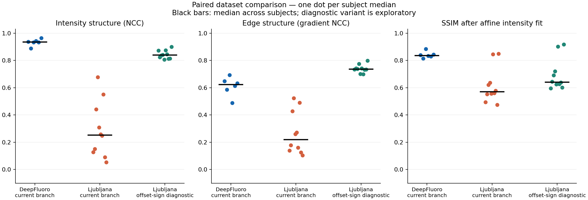
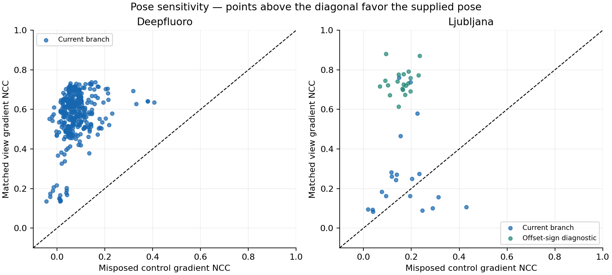

# Paired DeepFluoro and Ljubljana comparison

This report records 382 matched projections generated with the CUDA/Slang X-ray
simulator from [PR #73](https://github.com/isaac-for-healthcare/i4h-sensor-simulation/pull/73),
at commit `8b3753f555314179835b8dd266ccaeb60b83c203`. The run finished on
2026-10-05 UTC with no failed subjects: 362 eligible DeepFluoro views from six
subjects and 20 primary Ljubljana views from ten subjects.

DeepFluoro shows strong structural agreement. Ljubljana exposes a likely
horizontal detector-offset convention issue: a separate sign-reversal diagnostic
improves agreement on all 20 views. The diagnostic is exploratory and is not a
verified adapter fix. These results do not establish physical scanner calibration
or independently validate X-ray and fluoroscopy realism.

## Results

Values are medians of the per-subject medians, giving each subject equal weight.
Higher NCC and gradient NCC indicate better structural agreement. Shape SSIM
includes an in-sample nonnegative gain/bias fit and does not establish calibrated
intensity. No acceptance threshold was specified.

| Dataset and geometry | Subjects | Views | NCC | Gradient NCC | Shape SSIM | Matched beats misposed |
| --- | ---: | ---: | ---: | ---: | ---: | ---: |
| DeepFluoro, current branch | 6 | 362 | 0.936 | 0.623 | 0.836 | 362/362 |
| Ljubljana, current branch | 10 | 20 | 0.253 | 0.219 | 0.570 | 15/20 |
| Ljubljana, offset-sign diagnostic | 10 | 20 | 0.840 | 0.737 | 0.641 | 20/20 |

“Matched beats misposed” compares gradient NCC against an independently rendered
control with an additional 5 mm translation along simulator X and 5° rotation
about simulator world Z, using the same reference and detector ROI.



The Ljubljana pilot's first frontal view was displaced horizontally by about
81 binned pixels. This matches twice the supplied horizontal detector offset
divided by the binned detector pitch. Negating only that offset improved gradient
NCC for every Ljubljana view. Camera pose, vertical offset, image alignment and
other renderer settings were held fixed. No registration, image translation or
pose optimization was applied. The current branch remains the primary result.



## Numerical checks

- All 382 expected pairs completed and have finite metrics and correctly shaped
  reference/generated arrays.
- The first eligible view of each of the 16 subjects was also rendered with a
  0.25 mm integration step, compared with the main 0.5 mm run. The maximum relative
  L2 difference in attenuation was **0.429%**. This is a numerical consistency
  check, not an external accuracy measurement.
- All 18 simulator source hashes matched the pre-run snapshot. No simulator
  source was changed for this experiment or its offset diagnostic.

## Methods

| Item | Configuration |
| --- | --- |
| Input release | `eigenvivek/xvr-data`, revision `a17273e3eadbd793bd861f3598a80ce4590c1124` |
| Pairing | Matching subject volume, supplied pose and per-view detector intrinsics through `xray_simulator.validation.xvr` |
| Sampling | 4×4 detector binning; 0.5 mm ray integration step |
| DeepFluoro crop | 50 pixels from each edge before binning: 1536×1536 to 1436×1436, then 359×359 |
| Exclusions | Upstream-flagged DeepFluoro subject01 `003`/`050` and subject04 `002`/`004`; Ljubljana uses frontal/lateral primary views, excluding `_max` images |
| DeepFluoro volume | Example HU mapping: center 200, width 1600, maximum attenuation coefficient 0.05/mm |
| Ljubljana volume | Uncalibrated vessel-contrast proxy: `max(stored_value, 0) × 5e-6` per mm; the same coefficient for all subjects; not treated as HU |
| Primary ROI | Central 90% of each cropped detector, excluding a 5% margin per edge, fixed before scoring; not an anatomical segmentation |
| Secondary Ljubljana ROI | Detector ROI intersected with projected vessel support above `1e-4` attenuation, dilated by 10 pixels; model-defined, not independently annotated |
| Reference display | Unsigned 16-bit DICOM divided by 65535; the X-ray counterpart is its opposite polarity |
| Display variants | Default log window `[0,6]`, and a separate subject window derived from attenuation percentiles 1/99 of the first generated view and then frozen |
| Statistics | Per-view scores, per-subject medians and quartiles, and median of subject medians; no confidence interval from views of unestablished acquisition independence |

For the structural comparison, let `s` be the reference scaled by its minimum
and maximum within the detector ROI and clipped to `[0,1]`. DeepFluoro uses
`log(2 / (1 + s)) / log(2)` as its reference proxy, following the upstream xvr
preprocessing with an explicit final unit scale. Ljubljana uses `1 - s` for its
subtraction angiograms, without a second logarithm. These proxies are compared
with simulated attenuation divided by the fixed default window width, 6, without
clipping. Metric settings are `data_range=1`, histogram range `[0,1]`, and 64 bins.

Reference contrast previews in the local gallery are for visual inspection.
Display scores use the fixed stored reference scale. The generated subject window
is derived only from the simulator output; it is not fitted to the real image.
The [protocol](protocol.json) records the full settings, package versions and
simulator source hashes. Metric definitions are in the
[validation guide](../../validation.md#metric-definitions).

## Interpretation and limits

The evidence supports anatomical and projection-structure agreement on
DeepFluoro. Ljubljana needs verification of the detector-offset convention and a
validated adapter correction before equivalent claims can be made for the
current branch.

Both X-ray and fluoroscopy appearances use the same simulated transport with
opposite display polarity. These are still images, not independent simulations
of different exposures or a fluoroscopy cine sequence. This experiment does not
validate absolute attenuation, scanner brightness, dose, noise, scatter, detector
lag, motion or temporal behavior. Ljubljana's vessel mapping is explicitly
uncalibrated. Instruments, collimation, truncation, contrast filling and acquisition
processing can affect agreement. No scanner parameters were fitted on training
subjects and evaluated on held-out subjects.

## Artifacts

- [Dataset summaries](dataset_summary.csv).
- [Per-subject summaries, including quartiles](per_subject_summary.csv).
- [Per-view metrics](per_view_metrics.csv): 382 primary rows plus 20 explicitly
  labeled Ljubljana diagnostic rows. The `directory` column identifies the pair
  within the local rendering output; it is not a link to public patient imagery.
- [Full numerical report index](report.json): `pair_files` links to the numerical
  measurements and geometry for all 382 pairs, including diagnostic and display
  measurements. Pair contents are unchanged from the local report.
- [Integration checks](integration_checks.csv), [completion status](run_status.json)
  and [run verification](verification.json).
- [PDF summary figure](comparison_summary.pdf).
- [Publication provenance](publication.json), including hashes of the original
  report and run scripts.

The public report contains numerical measurements and metric plots. Source
volumes, reference/generated anatomy images, raw arrays and the interactive image
gallery remain in the local run directory
`xray-simulator/output/paired_deepfluoro_ljubljana_20261005_032129/`.
This follows the [dataset guide](../../validation-datasets.md): DeepFluoro is
CC BY-NC 4.0; Ljubljana is CC BY-NC-ND 4.0, with the xvr remix hosted by permission.
The simulator's license does not relicense those datasets or derived imagery.

## Reproduce locally

The [rendering script](render_and_compare.py) preserves the run logic, with local
paths configured through environment variables. Its optional inventory hash is
recorded when a `manifest.json` exists above the fluoroscopy data directory.
The [report builder](build_local_report.py) reconstructs the local image gallery,
plots and CSVs from a complete rendering output. Generated images remain local.

Use the pinned simulator commit above and obtain the dataset separately following
the dataset guide. Install the rendering/validation extras and Matplotlib in a
CUDA-capable environment; exact versions from this run are in `protocol.json`.
From a checkout containing these report scripts:

```bash
export I4H_SENSOR_SIMULATION_REPO=/path/to/simulator-at-recorded-commit
export I4H_VALIDATION_DATA_ROOT=/path/to/validation-data/fluoroscopy
export OPENBLAS_NUM_THREADS=1
export OMP_NUM_THREADS=1

python xray-simulator/docs/reports/deepfluoro-ljubljana/render_and_compare.py \
  --output /path/to/new-local-render-output
python xray-simulator/docs/reports/deepfluoro-ljubljana/build_local_report.py \
  /path/to/new-local-render-output
```

Use a new output directory. The full run requires the six DeepFluoro and ten
Ljubljana subject volumes and their primary DICOM/PT view companions. The scripts
do not download datasets or publish outputs. Host-specific protocol paths are
replaced by placeholders in this public snapshot; measurements are unchanged.

## Sources

- [xvr-data release](https://huggingface.co/datasets/eigenvivek/xvr-data), pinned
  revision above.
- [DeepFluoro](https://github.com/rg2/DeepFluoroLabeling-IPCAI2020): Grupp et al.,
  [Automatic annotation of hip anatomy in fluoroscopy for robust and efficient 2D/3D registration](https://doi.org/10.1007/s11548-020-02162-7), 2020.
- [Ljubljana 3D-2D-GS-CA](https://lit.fe.uni-lj.si/en/research/resources/3D-2D-GS-CA/):
  Mitrović et al., [3D-2D registration of cerebral angiograms: A method and evaluation on clinical images](https://ieeexplore.ieee.org/abstract/document/6507588), 2013.
- [Pinned xvr reference preprocessing](https://github.com/eigenvivek/xvr/blob/caa55cc8096294cf70a218126bf16008dee0dec7/src/xvr/io/xray.py).
