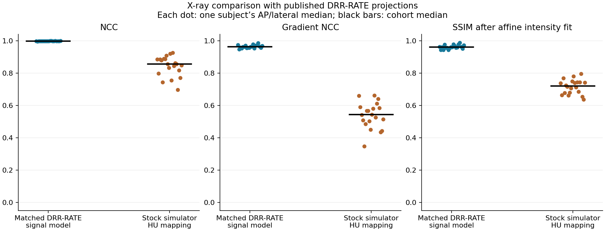
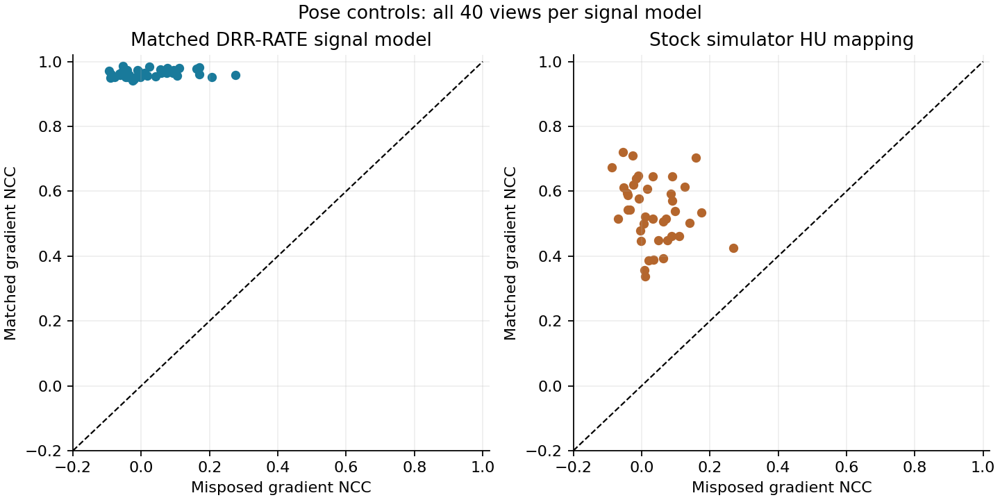

# X-ray comparison against DRR-RATE

Generated and compared **40 matched X-ray views from 20 distinct CT-RATE validation subjects**, with AP and lateral views for each subject. The reference images are published DRR-RATE PNGs generated by the independent Siddon–Jacobs renderer. The i4h simulator source was unchanged at commit `8b3753f555314179835b8dd266ccaeb60b83c203`.

## Measured agreement

Each value is the median across per-subject AP/lateral medians. Shape SSIM includes an in-sample gain/bias fit; it does not establish intensity calibration.

| Signal model | NCC | Gradient NCC | Shape SSIM | Matched beats misposed |
| --- | ---: | ---: | ---: | ---: |
| Matched DRR-RATE signal model | 0.9985 | 0.9637 | 0.9609 | 40/40 |
| Stock simulator HU mapping | 0.8567 | 0.5427 | 0.7201 | 40/40 |



The matched recipe uses the published -100 HU threshold: `mu_proxy = max(trunc(HU)+100,0) * 1e-5 /mm`. The stock mapping uses the simulator's actual `HuToMuMapping()` defaults, from -1000 HU / 0 per mm to 3000 HU / 0.02 per mm. Both use the same source-derived projection geometry. No registration, pose optimization, or reference-fitted window was applied.

Using the matched signal model and emulating the reference export (alpha-integral, signed-short quantization, generated-image min/max scaling, 8-bit output), display SSIM was **0.961**. This export normalization is part of matching the published synthetic pipeline; it does not validate absolute brightness. The simulator's fixed `[0,6]` X-ray window scored **0.297** with the matched signal model and **0.666** with the stock HU mapping.

## Scope and interpretation

This is an independent **synthetic X-ray renderer comparison**. It adds a chest dataset beyond the earlier DeepFluoro/Ljubljana experiment. Strong agreement under the matched recipe supports geometric and projection-structure consistency with the published DRRs. Results for the stock mapping are reported separately because its signal model differs from DRR-RATE.

DRR-RATE images are synthetic; this is not validation against real diagnostic radiographs. The experiment does not validate dose, spectrum, scatter, noise, detector response, temporal behavior, clinical findings or task performance. No pass/fail threshold was defined. The cohort is a deterministic 20-subject subset, not the full validation split.

## Verification and controls

- All 40 pairs completed under both mappings, producing 80 scored comparisons and independent misposed controls.
- Every subject's AP view with the matched recipe was also rendered at 0.25 mm versus the normal 0.5 mm integration step. Maximum relative L2 difference: **0.435%**.
- Every render was checked against the shader's 2048-step limit. No transmission values hit the attenuation extraction floor.
- The control increments the camera translation parameter by 5 mm along simulator X and premultiplies its orientation by a 5° world-Z rotation. Complete poses are retained in each record.
- All source CT files passed upstream SHA-256 checks. The CT-RATE v1 HU intercept/slope and voxel-spacing corrections came from the authors' validation metadata.
- All simulator source hashes match the pre-run snapshot. Numerical integration checks measure consistency, not external physical calibration.

## Inspect the results

- [All per-view metrics](per_view_metrics.csv), [subject summaries](per_subject_summary.csv), [cohort summaries](cohort_summary.csv), and [AP/lateral summaries](projection_summary.csv).
- [Full numerical report index](report.json), [protocol and source hashes](protocol.json), [cohort](cohort.json), [pre-scoring selection](selection.json), and [integration checks](integration_checks.csv).
- [Comparison plot as PDF](comparison_summary.pdf), [verification record](verification.json), [run completion](run_status.json), and [publication provenance](publication.json).
- [Rendering script](render_and_compare.py) and [local report builder](build_local_report.py).



The full per-view records are stored in `metrics/`, split by case. Concatenate the arrays listed in `report.json`'s `pair_files` order to reconstruct the original report's `pairs` array. All numerical values are unchanged. The `directory` fields in JSON and CSV refer to paths inside the local render output, not files in this repository.

The interactive image report (`REPORT.html`), all-subject anatomy sheets, source volumes, reference/generated anatomy images, and raw arrays remain local. References and generated anatomy images retain their dataset restrictions; the simulator license does not relicense them.

## Reproduce locally

Use the simulator commit recorded above and the package versions and dataset revisions in [protocol.json](protocol.json). Obtain the CT-RATE and DRR-RATE files under their respective dataset terms, preserving the relative paths in [cohort.json](cohort.json). The validation-data directory must also contain `ct_rate/dataset/metadata/validation_metadata.csv` and `ct_rate/dataset/metadata/no_chest_valid.txt` from the recorded CT-RATE revision. These scripts do not download data or accept dataset terms.

Run from the checkout containing this report, with an environment providing the recorded dependencies and a CUDA-capable GPU. `I4H_SENSOR_SIMULATION_REPO` can point to a separate checkout at the recorded rendering commit:

```bash
export I4H_SENSOR_SIMULATION_REPO=/path/to/simulator-at-recorded-commit
export I4H_XRAY_VALIDATION_DATA=/path/to/validation-data
export OPENBLAS_NUM_THREADS=1
export OMP_NUM_THREADS=1
python xray-simulator/docs/reports/drr-rate/render_and_compare.py \
  --output /path/to/new-local-output
python xray-simulator/docs/reports/drr-rate/build_local_report.py \
  /path/to/new-local-output
```

Choose a new output directory. The renderer produces all 80 comparisons, the misposed controls, and the 20 integration checks. The local report builder verifies those outputs, computes summaries, and creates the interactive image gallery and anatomy sheets. Machine-specific input paths in the archived renderer were replaced by environment variables and adjacent cohort/selection manifests; rendering and metric calculations are unchanged.

## Sources

- [DRR-RATE](https://huggingface.co/datasets/farrell236/DRR-RATE), revision `500d7868a84478eb0bafcdee793d1246f492c986`; Hou et al., [Shadow and Light](https://arxiv.org/html/2406.03688v1).
- [CT-RATE](https://huggingface.co/datasets/ibrahimhamamci/CT-RATE), revision `deeca4d89e9f978d4d1bccd88a55071ddbb146bb` and its validation metadata/correction note.
- [Reference generator](https://github.com/farrell236/midas-journal-784/blob/889727fe0049bf89091f9c2d943299f428ba2a65/getDRRSiddonJacobsRayTracing.cxx).
- [Siddon–Jacobs implementation reviewed](https://github.com/InsightSoftwareConsortium/ITKTwoProjectionRegistration/blob/fc9714977f5c053a0b68eb5a3761812496ab781b/include/itkSiddonJacobsRayCastInterpolateImageFunction.hxx).
