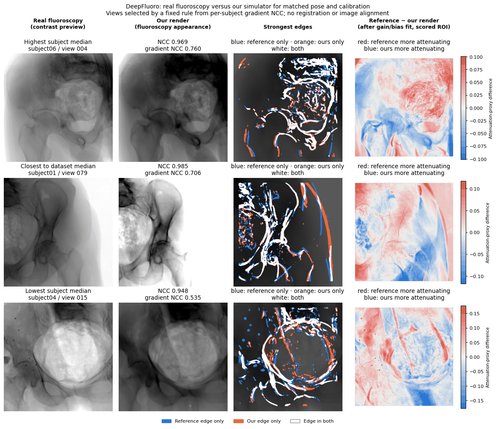

# X-ray and fluoroscopy image validation

The validation module measures agreement between explicitly paired images of the
**same subject, anatomy, projection and detector grid**. It runs on the CPU and
does not require a renderer, GPU, network connection or downloaded dataset.

This is evaluation tooling, not a claim that the simulator reproduces a clinical
scanner. The repository includes analytical metric tests and a
[paired DeepFluoro/Ljubljana comparison report](reports/deepfluoro-ljubljana/README.md)
covering 382 matched views, with the dataset geometry conventions it relies on
and the changes since its previous version. A separate
[DRR-RATE X-ray comparison report](reports/drr-rate/README.md) covers 40 AP/lateral
views from 20 CT subjects against an independent synthetic renderer, with both
the matched DRR-RATE signal model and the stock simulator HU mapping. It includes
misposed controls and integration-step checks. Apart from the attributed
DeepFluoro samples below, dataset images remain local; these structural
comparisons do not establish physical or clinical validation.

## Latest results

Three paired comparisons have been run with the simulator: two against real
clinical acquisitions and one against an independent synthetic renderer. Each
view is rendered with the reference's own volume, pose and detector calibration,
without registration or image alignment, and scored with the metrics defined
below. Values are medians of per-subject medians, so each subject counts equally.

| Comparison | Reference images | Subjects | Views | NCC | Gradient NCC | Shape SSIM | Matched beats misposed |
| --- | --- | ---: | ---: | ---: | ---: | ---: | ---: |
| [DeepFluoro](reports/deepfluoro-ljubljana/README.md) | Real pelvis fluoroscopy | 6 | 362 | 0.939 | 0.681 | 0.850 | 362/362 |
| [Ljubljana](reports/deepfluoro-ljubljana/README.md) | Real cerebral subtraction angiography | 10 | 20 | 0.840 | 0.737 | 0.641 | 20/20 |
| [DRR-RATE](reports/drr-rate/README.md), matched signal model | Synthetic chest DRRs (Siddon–Jacobs) | 20 | 40 | 0.998 | 0.964 | 0.961 | 40/40 |
| [DRR-RATE](reports/drr-rate/README.md), stock HU mapping | Synthetic chest DRRs (Siddon–Jacobs) | 20 | 40 | 0.857 | 0.543 | 0.720 | 40/40 |

- **NCC** and **gradient NCC** measure structural agreement of intensities and
  edges. They are the primary scores.
- **Shape SSIM** follows a per-image gain/bias fit, so it does not measure
  brightness or physical calibration.
- **Matched beats misposed** counts views whose gradient NCC exceeds that of a
  control rendered 5 mm and 5° away from the supplied pose. Every view in every
  comparison passes, so the scores respond to pose rather than to generic
  anatomy.
- Rendering at a 0.25 mm instead of 0.5 mm integration step changes attenuation
  by at most 0.43% in both reports.

The DeepFluoro and Ljubljana results include the dataset adapter's principal-point
and DeepFluoro voxel-origin corrections; their
[report](reports/deepfluoro-ljubljana/README.md#changes-since-the-previous-report)
lists the scores before and after. DRR-RATE uses a centred detector without the
adapter, so those corrections do not affect it. Against the real acquisitions,
Ljubljana uses an uncalibrated vessel-contrast model and DeepFluoro an example HU
mapping, so the remaining differences include intensity modelling as well as
anatomy. DRR-RATE references are synthetic: they test consistency with another
renderer, not realism.


### DeepFluoro sample comparisons



The rows are chosen by a fixed rule rather than by appearance: the subjects with
the highest, closest-to-median and lowest median gradient NCC, and for each the
view closest to that subject's median. Columns, left to right:

1. **Real fluoroscopy**, contrast-stretched for viewing.
2. **Our render** in fluoroscopy appearance, with the view's NCC and gradient NCC.
3. **Edge overlay:** the strongest 12% of edges in the scored region, in blue for
   the reference only, orange for our render only and white where they coincide.
4. **Difference map:** the reference attenuation proxy minus our render after
   the same gain/bias fit as Shape SSIM. Red marks where the reference attenuates
   more, blue where our render does.

What the samples show:

- **Bone contours** of the pelvis and femur largely coincide (white) in all three
  views, consistent with the near-zero residual misalignment reported for the
  dataset (0.19 binned pixels RMS).
- **Intensity distribution** differs smoothly across each view after the fit.
  For example, the reference attenuates more across the large textured bony
  region at the centre of the first row. This reflects the example HU-to-attenuation
  mapping and the reference's acquisition processing, not geometry.
- **Soft-tissue and field boundaries** account for most edges seen in only one
  image. The second row shows an orange-only outer contour where the reference
  contrast is flat.
- **Objects absent from the CT** appear only in the reference: the small dark
  dots in the third row show as red points in the difference map. That view,
  from the lowest-scoring subject, also shows partly offset outer contours.

DeepFluoro images: Grupp et al., [DeepFluoro](https://github.com/rg2/DeepFluoroLabeling-IPCAI2020),
CC BY-NC 4.0, via the pinned [xvr-data](https://huggingface.co/datasets/eigenvivek/xvr-data)
release; cropped, binned and shown beside our renders. Ljubljana (CC BY-NC-ND 4.0)
and DRR-RATE/CT-RATE images are not reproduced. Regenerate the figure from a
complete local run with
[`make_sample_figure.py`](reports/deepfluoro-ljubljana/make_sample_figure.py).

## Install and run

From the repository root:

```bash
python -m pip install -e './xray-simulator[validation]'
python -m xray_simulator.validation pairs.json --output results/report.json --dryrun
python -m xray_simulator.validation pairs.json --output results/report.json
```

The preview checks manifest structure and file existence. The actual run also
checks pixel values, masks and dimensions. It never resizes, registers, inverts,
or independently normalizes images. An existing report is never overwritten.

Use this manifest structure, with paths relative to the manifest:

```json
{
  "schema_version": 1,
  "domain": "attenuation_proxy",
  "data_range": 1.0,
  "histogram_range": [0.0, 1.0],
  "bins": 64,
  "provenance": {
    "dataset_revision": "record the exact dataset revision",
    "simulator_commit": "record the renderer commit",
    "preprocessing": "record crop, polarity, intensity mapping and mask construction",
    "geometry": "record CT orientation/affine, pose convention, SDD, detector pitch and principal point",
    "render_settings": "record HU-to-mu mapping, step size, display settings and noise seeds"
  },
  "pairs": [
    {
      "dataset": "example-dataset",
      "subject": "subject01",
      "view": "000",
      "reference": "prepared/reference.npy",
      "rendered": "prepared/rendered.npy",
      "mask": "prepared/anatomy_mask.npy"
    }
  ]
}
```

The identifiers declare the intended pairing; matching dimensions cannot prove
that the subject and camera are actually matched. The caller must establish that
correspondence. Use one manifest per experiment, signal domain and fixed metric
scale. Do not mix display presets or ablation variants into a subject summary.
The full manifest, input SHA-256 hashes, metric implementation hashes and library
versions are retained in the report.

Optional per-pair fields:

| Field | Meaning |
| --- | --- |
| `misposed` | Path to a render with a documented 3D pose perturbation. The report includes its scores and the aligned-minus-misposed gradient NCC difference. |
| `acquisition` | Identifier of an independent acquisition within this subject. All frames from the same correlated cine sequence share an ID. |

The report contains every image's scores and median, quartiles and IQR separately
for each dataset/subject. When every view has an acquisition ID and at least two
independent acquisitions are present, it also computes a 95% percentile bootstrap
interval for the median by resampling whole acquisitions (2,000 draws, `--seed 0`
by default). This interval is conditional on that subject. With fewer groups or
undefined scores, the corresponding interval is `null`. Small numbers of
acquisitions give unstable intervals; do not interpret a narrow interval from
repeated frames as evidence about a patient population. Subjects are never pooled
into a single score.

## Signal domains and export

| Domain | Input | Reports |
| --- | --- | --- |
| `display` | Prepared float arrays in [0, 1], or 8-bit grayscale PNGs | As-configured scores in normalized grayscale; no attenuation fit or radial attenuation profile |
| `attenuation` | Float arrays of calibrated `A = -ln(I / I0)` | As-configured and shape-only scores in dimensionless line-integral units |
| `attenuation_proxy` | Explicitly prepared, consistently oriented attenuation-like arrays with uncalibrated scale | The same two evaluations, labeled arbitrary proxy units |

Array inputs are 2D `.npy` files loaded with `allow_pickle=False`. The fixed anatomy
mask is a boolean/0–1 `.npy` array or a black/white PNG. RGB/RGBA PNGs are accepted
only when all color channels match and alpha is opaque. Colored overlays are
rejected. Grayscale captions, collimator borders and baked-in markers still need
to be excluded by the caller. For 16-bit images and DICOM, perform an explicit
preparation step; the runner does not guess rescale slopes, modality LUTs,
photometric interpretation or window levels.

To retain simulator intensity alongside its displayed frame:

```python
import numpy as np

from xray_simulator import Pose, SimulatorConfig, xray_simulator
from xray_simulator.validation import attenuation_from_intensity

# `volume` is a preprocessed volume in the canonical patient frame.
config = SimulatorConfig.for_appearance("fluoro").with_output(keep_intensity=True)
simulator = xray_simulator(volume, config)
frame = simulator.render_frame(pose=Pose.ap())

np.save("rendered_display.npy", frame.image)
np.save("rendered_intensity.npy", frame.intensity)
np.save("rendered_attenuation.npy", attenuation_from_intensity(frame.intensity, frame.i0))
```

This illustrates export only: a benchmark comparison must use its calibrated
pose and intrinsics instead of the default AP pose and detector. Record the
configuration and CT affine with the export. Retained intensity is after enabled
realism effects and before display processing. Disable realism for the baseline
transport check and record each enabled effect for ablations.

`attenuation_from_intensity` floors transmission at `1e-8` by default; record any
changed floor and inspect how many rays reach it. Intensity above `I0` gives
negative attenuation and is not silently clipped. A windowed or min/max-normalized
PNG cannot be converted back to calibrated attenuation by taking its logarithm.
Likewise, unknown vendor processing generally makes real radiographs suitable for
an explicitly documented proxy comparison, not absolute attenuation RMSE.

For a display run, set `data_range` to 1 and `histogram_range` to `[0, 1]`. For
attenuation/proxy runs, choose and document the SSIM range and histogram bounds
before evaluation, keeping them fixed across the cohort and its ablations.
Do not choose new ranges independently for every candidate image.

## Metric definitions

| Metric | Implementation and interpretation |
| --- | --- |
| NCC | Zero-mean correlation within the fixed anatomy mask. Constant-signal correlation is undefined (`null`). |
| Gradient NCC | NCC of Sobel-gradient magnitude. Uses only centers whose complete 3×3 neighborhood is inside the mask. Primary structural score. |
| Mutual information | Joint histogram with 64 bins per axis by default, natural logarithm, fixed bounds. Outliers enter the boundary bins and their fractions are reported. |
| SSIM | Gaussian window, sigma 1.5, 11×11 support, population covariance and explicit `data_range`. Only windows entirely inside the mask contribute. |
| RMSE | Root mean squared difference inside the mask. Units follow the chosen signal domain. |
| Wasserstein distance | One-dimensional distance between the masked pixel-value distributions in the chosen domain. Uses all values, independent of the MI binning. |
| Radial profiles | Masked mean attenuation/proxy in 16 annuli about detector-array center; radius is in pixels. These are descriptive profiles, not a beam-hardening measurement. |

SSIM parameters follow the [scikit-image API](https://scikit-image.org/docs/stable/api/skimage.metrics.html#skimage.metrics.structural_similarity).
Histogram distance uses [SciPy's Wasserstein implementation](https://docs.scipy.org/doc/scipy/reference/generated/scipy.stats.wasserstein_distance.html).

For attenuation domains, **shape-only** fits `reference ≈ gain * rendered + bias`
by least squares on the same mask with `gain >= 0`. It does not fit pose or spatial
warps. The as-configured result always retains the original inputs. A constant
render has no identifiable gain; a zero-gain optimum is flagged so polarity or
pairing errors are not hidden. Fitting gain removes absolute attenuation-scale
information: even an excellent fitted RMSE does not establish physical calibration.

Gradient magnitude is insensitive to additive offset and its NCC is invariant to
positive global gain, but a nonlinear tone curve can change local edge weights.
It also cannot distinguish opposite image polarities by itself. Inspect NCC and
the declared display convention alongside it. MI depends on histogram settings;
Wasserstein distance ignores spatial arrangement. No individual score establishes
clinical realism.

## Evaluation protocol

1. **Verify geometry and transport.** Use analytical slabs/spheres, known point
   projections and step-size convergence before comparing real anatomy. Existing
   geometry tests provide CPU checks; successful metric tests do not verify the
   GPU renderer or a scanner model.
2. **Prepare matched references.** Follow the [dataset guide](validation-datasets.md).
   Render the same volume at the reference pose with its own detector geometry.
   Verify coordinate conventions, cropping and polarity before selecting masks.
   Include an independent deliberately misposed render, for example a specified
   5 mm translation and 5° rotation about named axes. An image-space shift is only
   a metric smoke test, not a calibrated 3D control.
3. **Separate shape and calibration.** Evaluate uncalibrated real images in a
   documented proxy domain. Evaluate the actual fixed display preset separately
   in the display domain, without per-image gain/bias or window fitting. Fit
   parameters on training subjects and evaluate on held-out subjects.
4. **Run component ablations.** Compare the baseline with HU-to-μ alternatives,
   detector blur, gain/bias, noise and display settings, recording all parameters
   and seeds. Independent noise realizations need not improve pixel RMSE even if
   the noise model is more realistic. Assess them with repeated realizations and
   noise statistics instead of demanding monotonic RMSE improvement.
5. **Report relative acceptance.** Pre-register the required gradient-NCC margin
   over the misposed control and acceptable held-out calibration error. The tool
   reports the gap and does not invent pass/fail thresholds. Keep per-subject
   distributions and acquisition-level uncertainty visible.

Detector MTF/NPS, dose-dependent DQE, scatter and temporal behavior require
additional calibrated acquisitions or phantoms. Registration accuracy, catheter
localization, task performance and observer studies are separate validation
stages. The [xvr geometry adapter and single-view exporter](validation-datasets.md#geometry-adapter-for-the-downloaded-xvr-release)
prepare matched dataset geometry separately. Cohort calibration, physics/task
evaluations and automatic clinical acceptance are not implemented by this metric runner.

## Test without patient data

```bash
python -m pip install -e './xray-simulator[dev,validation]'
python -m pytest xray-simulator/tests/test_validation.py
```

The tests check analytical identity/affine behavior, sensitivity to spatial
misalignment, polarity ambiguity, fixed mask support, histogram outliers,
Beer–Lambert inversion, input rejection and reproducible acquisition bootstrap.
They exercise the CLI end to end with generated arrays and run in CPU CI.
